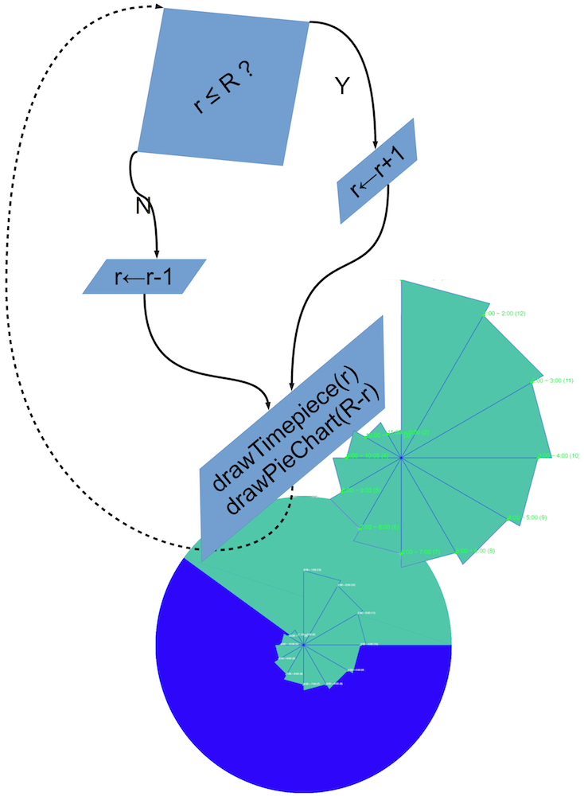

! [Foursquare app](readme.png)

# Introduction & background:

+ Started on [18/3/2013](https://github.com/yoga1290/Foursquare-Attendance-Competition/commit/6dc0870daaff1da2cd13c59d84697569a02df08d)

+ Inspired by [ITWORX Facebook post](http://www.facebook.com/photo.php?fbid=10151461625860236&set=a.10151284196710236.515025.13913005235&type=1)

+ divided into 3 parts:
	> + Main page
	> + Update page ( for certain user(s) )
	> + Java Servlet class (Google AppEngine)

---

# [Main page](4sqr.html):
---
The main page is all about displaying the results; the total checkins by users based on the recent update

---
### Data representations:

+	__curInd:__

	> + representing the index of the current user to be displayed
	> + changes value from time to time by __animate__ function

+	__color[]:__

	>Array where __colour[i]__ will be used for representing the __i__-th user data in both of the pie-chart & time piece graph

+	__checkinsCount[]:__

	>Array where __checkinsCount[i]__ is the total number of checkins done by the __i__-th user

+	__timedata[]:__

	>2D Array (array of an array) where __timedata[i]__ represents 12-element array where each element represents the total number of checkins done by the __i__-th user in that hour (working daylight hours; ignoring the AM/PM )
	>
	>e.g:
	>
	> + __time data[ i ][ j ]:__ represents the number of total checkins done by the __i__-th user in the __j__-th hour

---

### Animation functions:
+	__drawTimePiece( i, r ):__

	> draws a Time piece graph based on data from the  __timedata[curInd]__ in the #__tpgraph__ canvas where width=height=__r__

+	__drawChart( r ):__

	> draws a pie-chart in the #__canvas__ canvas based on the __checkinsCount[]__ data, where the __color[i]__ slice represents the __i__-th user , where width=height=__r__

+	__animate ( i, r, zoomIn):__

	> Calls __drawChart__( i, r ± animate_speed);
	>
	> + __i__ : the current index of the user to be displayed
	> + __r ± animate_speed__ : the radius of the pie-chart
	>
	> Calls __drawTimePiece__( i, r ± animate_speed);
	>
	> + __i__ : the current index of the user to be displayed
	> + __r ± animate_speed__ : the radius of the time piece graph
	>
	> Recurse call: __animate__( i, r, zoomIn);
	>
	> + __i__ : the current index of the user to be displayed
	> + __r __ : the radius of the pie chart & time piece graph
	> + __ zoomIn __ : the boolean value that tells whatever to increase or decrease the value of __r__ by __animate_speed__ next recurse call (after few msec)

---

# [Update page](update.html):

After Foursquare OAuth login, certain user(s) ,with specific foursquare userId, will be directed to the update page and the server will fill the required data to initiate the update loop which is basically looping across every user and calculates the __timedata[]__ , __checkinsCount[]__ , __color[]__ & __max_checkin__ based on certain venueId and sends update data back to the server which will later be redirected to the Main page

… will discuss more later (someday sometime when I’m free!)