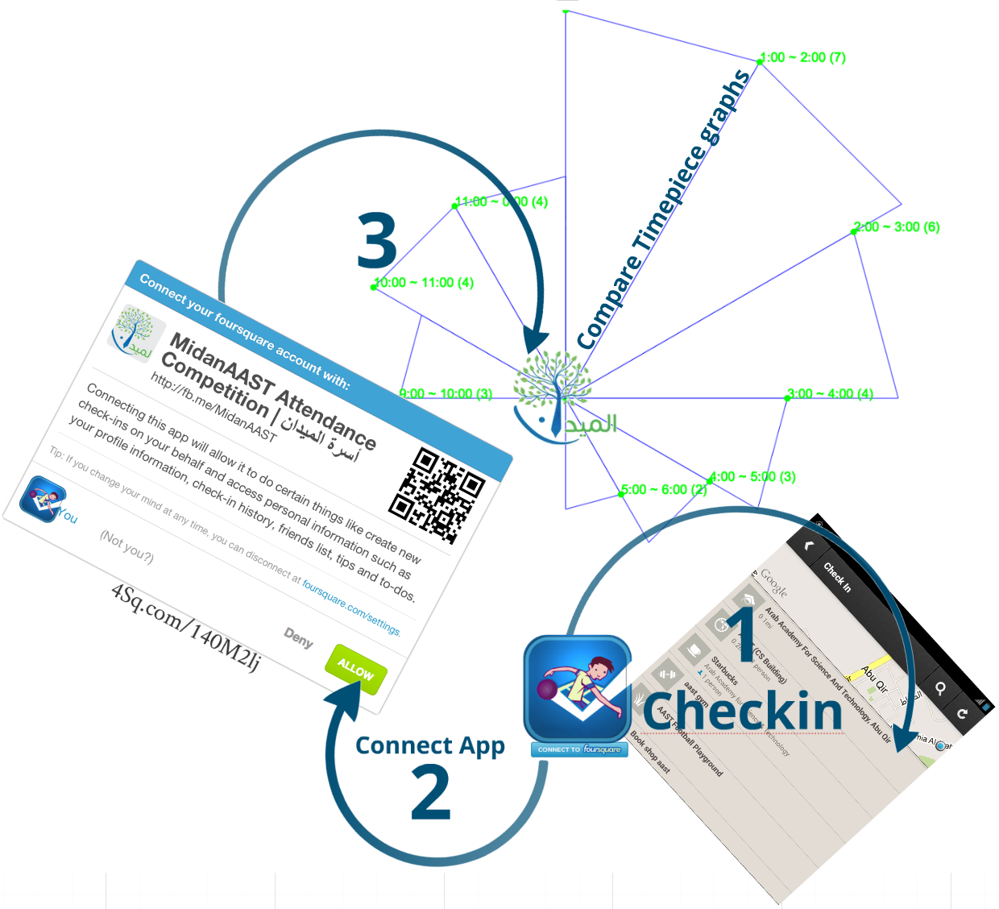

+ Results are stored in the AppEngine datastore and are loaded every time the result URI ("/midan/4sqr/") is called.

+ Updating results through separate page; checking for admin Facebook's userID first,IFF it's familiar then the foursquare access tokens will be added to the update page as JS array which will do all the processing locally on the browser first before sending the updated data back to the datastore! (obviously to save some server quota!)